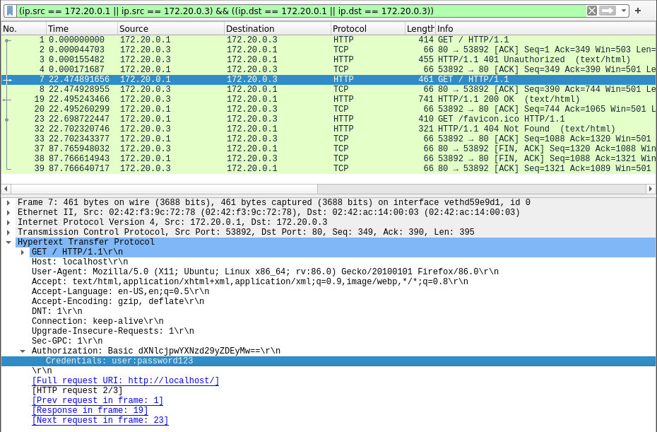
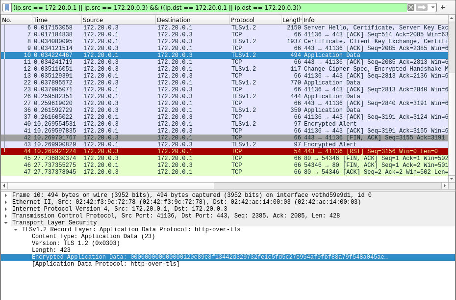
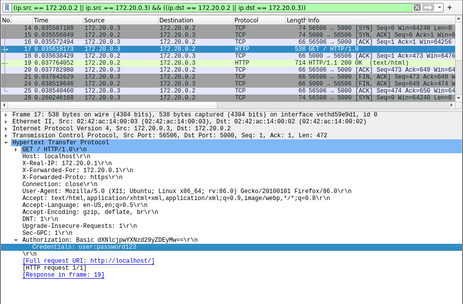

# Table of Contents

1.  [Task steps](#org04109f9)
    1.  [Install a web server](#orga61a7f0)
    2.  [Protect the access to a web page by means of a password and a captcha (i.e., reCAPTCHA).](#orgcc5e2fe)
    3.  [Connect via browser to that captcha and password-protected webpage](#org686dce2)
    4.  [Sniff the traffic between browser and web server and capture the password](#orgefb5b78)
    5.  [Configure the web server to use dual authentication using TLS (thus using digital certificates)](#org363a091)
    6.  [Show that sniffing the traffic now does not reveal the password](#orgf51b11f)
    7.  [Record a video of max 3 minutes showing your working solutions and configurations](#org87c1025)
    8.  [Submit your video to the classroom](#org3419f92)
    9.  [Deadline 10th March at 15.00](#orgf10bdc5)
2.  [Node.js + NGINX + Docker](#orgff147ff)
3.  [mTLS](#org38c3eec)
    1.  [Certificate Authority](#org0ba0b93)
    2.  [Client](#orge556334)
    3.  [Server](#orgeee2626)
4.  [NGINX dockerized proxy](#org36c0f25)
    1.  [NGINX and PEM password prompting](#orged23941)
5.  [Node.js dockerized app](#org48bb879)
6.  [Orchestration](#orga45630f)
7.  [Test](#org1ccab85)
    1.  [HTTP](#org2255edb)
    2.  [HTTPS](#org3e0e6e5)
8.  [References](#orga7c0be1)

[Link for submission](https://classroom.google.com/u/1/c/Mjc0MDYyNzE0Njcy/a/Mjc0MDYyNzE0Njc3/details)

# Task steps

## DONE Install a web server

## DONE Protect the access to a web page by means of a password and a captcha (i.e., reCAPTCHA).

## DONE Connect via browser to that captcha and password-protected webpage

## DONE Sniff the traffic between browser and web server and capture the password

## DONE Configure the web server to use dual authentication using TLS (thus using digital certificates)

## DONE Show that sniffing the traffic now does not reveal the password

## TODO Record a video of max 3 minutes showing your working solutions and configurations

## TODO Submit your video to the classroom

## Deadline 10th March at 15.00

# Node.js + NGINX + Docker

We are going to use

-   **Node.js:** An open-source JavaScript back-end runtime environment.
-   **NGINX:** An open-source web server that also serves as a reverse proxy and HTTP load balancer.
    -   **Web server:** A server that satisfies HTTP requests
    -   **Reverse proxy:** A server that sits in front of one or more web servers to provide
        -   **Security:** Hide the IP address of the web server
        -   **TLS support:** Handle encryption of outgoing responses and decryption of incoming requests using TLS
        -   **HTTP load balancing:** Handle HTTP traffic with multiple web servers
-   **Docker Engine and Docker Compose:** An open-source software engine used to host containers, Docker Compose provides orchestration

Why NGINX + Node.js? NGINX can

-   Worry about starting as root, binding to port 80, and then relinquishing its root privileges. So the Node app doesn&rsquo;t have to worry about it.
-   Serve static files like images, css, js, and html more efficiently then Node.
-   Display meaningful error pages or fall back onto a static site if Node crashes.
-   Help to mitigate security flaws and DoS attacks against Node.

Why Dockerizing this? Here, the only reason is to provide a self-contained and reproducible environment to play with.

# mTLS

In short, with mutual TLS

1.  Both client and server present a public certificate
2.  Both validate the certificate chain
3.  Negotiation continues with TLS

Certificates are issued by a trusted CA (Certificate Authority). While the CA should be an independent entity, in this case we are going to designate ourselves as a CA.

We are going to store all the certificates and related files here

    CERTS="./nginx/certs"

## Certificate Authority

We generate a key

    openssl genrsa -des3 -out ${CERTS}/ca.key 4096

Generating RSA private key, 4096 bit long modulus (2 primes)
&#x2026;&#x2026;&#x2026;&#x2026;&#x2026;&#x2026;&#x2026;&#x2026;&#x2026;&#x2026;&#x2026;&#x2026;&#x2026;&#x2026;&#x2026;&#x2026;&#x2026;&#x2026;&#x2026;&#x2026;&#x2026;&#x2026;&#x2026;&#x2026;&#x2026;&#x2026;&#x2026;&#x2026;&#x2026;&#x2026;&#x2026;&#x2026;&#x2026;&#x2026;&#x2026;&#x2026;&#x2026;..++++
&#x2026;&#x2026;&#x2026;&#x2026;&#x2026;&#x2026;&#x2026;&#x2026;&#x2026;&#x2026;&#x2026;&#x2026;&#x2026;&#x2026;&#x2026;&#x2026;&#x2026;&#x2026;&#x2026;&#x2026;&#x2026;&#x2026;&#x2026;&#x2026;&#x2026;&#x2026;&#x2026;&#x2026;&#x2026;&#x2026;&#x2026;&#x2026;&#x2026;&#x2026;&#x2026;&#x2026;&#x2026;&#x2026;&#x2026;&#x2026;&#x2026;&#x2026;&#x2026;&#x2026;&#x2026;&#x2026;&#x2026;&#x2026;&#x2026;&#x2026;&#x2026;&#x2026;&#x2026;&#x2026;&#x2026;&#x2026;&#x2026;&#x2026;&#x2026;&#x2026;&#x2026;&#x2026;&#x2026;&#x2026;&#x2026;&#x2026;&#x2026;&#x2026;&#x2026;&#x2026;&#x2026;&#x2026;&#x2026;&#x2026;&#x2026;&#x2026;&#x2026;&#x2026;&#x2026;&#x2026;&#x2026;&#x2026;&#x2026;.++++
e is 65537 (0x010001)
Enter pass phrase for ./nginx/certs/ca.key:
Verifying - Enter pass phrase for ./nginx/certs/ca.key:

And use it to generate a certificate, we set its `Organization Name` as `CertAuth`

    openssl req -new -x509 -days 3650 -key ${CERTS}/ca.key -out ${CERTS}/ca.crt

And the `.pem` file will include both

    cat ${CERTS}/ca.key > ${CERTS}/ca.pem
    cat ${CERTS}/ca.crt >> ${CERTS}/ca.pem

## Client

We generate a key

    openssl genrsa -des3 -out ${CERTS}/client.key 4096

Generating RSA private key, 4096 bit long modulus (2 primes)
&#x2026;&#x2026;&#x2026;&#x2026;&#x2026;&#x2026;&#x2026;&#x2026;&#x2026;&#x2026;&#x2026;&#x2026;&#x2026;&#x2026;&#x2026;&#x2026;&#x2026;&#x2026;&#x2026;..++++
&#x2026;&#x2026;&#x2026;&#x2026;.++++
e is 65537 (0x010001)
Enter pass phrase for ./nginx/certs/client.key:
Verifying - Enter pass phrase for ./nginx/certs/client.key:

The certificate must be approved by a CA, so we first generate a CSR (Certificate Signing Request) setting the `Organization Name` as `Client`

    openssl req -new -key ${CERTS}/client.key -out ${CERTS}/client.csr

And use it to generate a client certificate

    openssl x509 -req -days 365 -in ${CERTS}/client.csr -CA ${CERTS}/ca.crt -CAkey ${CERTS}/ca.key -set_serial 01 -out ${CERTS}/client.crt

Signature ok
subject=C = AU, ST = Some-State, O = Client
Getting CA Private Key
Enter pass phrase for ./nginx/certs/ca.key:

We can now verify if the generated certificate can be decrypted using the CA certificate

    openssl verify -verbose -CAfile ${CERTS}/ca.crt ${CERTS}/client.crt

./nginx/certs/client.crt: OK

If the client uses a web browser a `.PFX` file format is needed

    openssl pkcs12 -export -out ${CERTS}/client.pfx -inkey ${CERTS}/client.key -in ${CERTS}/client.crt -certfile ${CERTS}/ca.crt

Enter pass phrase for ./nginx/certs/client.key:
Enter Export Password:
Verifying - Enter Export Password:

## Server

We generate a key

    openssl genrsa -des3 -out ${CERTS}/server.key.org 4096

Generating RSA private key, 4096 bit long modulus (2 primes)
&#x2026;&#x2026;&#x2026;&#x2026;&#x2026;&#x2026;&#x2026;&#x2026;&#x2026;&#x2026;&#x2026;&#x2026;&#x2026;&#x2026;&#x2026;&#x2026;&#x2026;&#x2026;&#x2026;&#x2026;&#x2026;&#x2026;&#x2026;&#x2026;&#x2026;&#x2026;&#x2026;&#x2026;&#x2026;&#x2026;&#x2026;&#x2026;&#x2026;&#x2026;&#x2026;&#x2026;&#x2026;&#x2026;&#x2026;&#x2026;&#x2026;&#x2026;&#x2026;&#x2026;&#x2026;&#x2026;&#x2026;&#x2026;&#x2026;&#x2026;..++++
&#x2026;&#x2026;&#x2026;&#x2026;&#x2026;&#x2026;&#x2026;&#x2026;&#x2026;&#x2026;&#x2026;&#x2026;&#x2026;&#x2026;&#x2026;&#x2026;&#x2026;&#x2026;&#x2026;++++
e is 65537 (0x010001)
Enter pass phrase for ./nginx/certs/server.key.org:
Verifying - Enter pass phrase for ./nginx/certs/server.key.org:

We can remove the PEM passphrase with the following command (read [here](#orged23941) why).

    openssl rsa -in ${CERTS}/server.key.org -out ${CERTS}/server.key

Enter pass phrase for ./nginx/certs/server.key.org:
writing RSA key

The certificate must be approved by a CA, so we first generate a CSR (Certificate Signing Request) setting the `Organization Name` as `Server` and the `Common Name` as `localhost`

    openssl req -new -key ${CERTS}/server.key -out ${CERTS}/server.csr

And use it to generate a server certificate

    openssl x509 -req -days 365 -in ${CERTS}/server.csr -CA ${CERTS}/ca.crt -CAkey ${CERTS}/ca.key -set_serial 10 -out ${CERTS}/server.crt

Signature ok
subject=C = AU, ST = Some-State, O = Server, CN = localhost
Getting CA Private Key
Enter pass phrase for ./nginx/certs/ca.key:

We can now verify if the generated certificate can be decrypted using the CA certificate

    openssl verify -verbose -CAfile ${CERTS}/ca.crt ${CERTS}/server.crt

./nginx/certs/server.crt: OK

# NGINX dockerized proxy

The NGINX server will provide

-   The &ldquo;Basic&rdquo; HTTP authentication
-   Dual authentication with TLS

We generate a `.htpasswd` file to store an encrypted password for the user-id `user`.
The password is prompted by the following command.

    htpasswd -n user > ./nginx/.htpasswd
    cat ./nginx/.htpasswd

New password:
Re-type new password:
user:$apr1$hGNDxaCV$Xy50zFMco00QIed0MKS0Q.

We provide two distinct configuration files for NGINX

-   **noTLS:** With no encryption mechanism
-   **TLS:** Using two-way TLS

    cat ./nginx/noTLS.conf

server {
    listen 80 defaultserver;
    listen [::]:80 defaultserver;

location / {
    proxysetheader Host $host;
    proxysetheader X-Real-IP $remoteaddr;
    proxysetheader X-Forwarded-For $proxyaddxforwardedfor;
    proxysetheader X-Forwarded-Proto $scheme;

proxypass <http://nodeserver:5000>;

	authbasic &ldquo;Restricted Content&rdquo;;
        authbasicuserfile *etc/nginx*.htpasswd;
    }
}

    cat ./nginx/TLS.conf

server {
    listen 80 defaultserver;
    listen [::]:80 defaultserver;

location / {
    proxysetheader Host $host;
    proxysetheader X-Real-IP $remoteaddr;
    proxysetheader X-Forwarded-For $proxyaddxforwardedfor;
    proxysetheader X-Forwarded-Proto $scheme;

proxypass <http://nodeserver:5000>;

	authbasic &ldquo;Restricted Content&rdquo;;
        authbasicuserfile *etc/nginx*.htpasswd;
    }
}

Note that in both configurations NGINX is

-   Providing &rsquo;Basic&rsquo; HTTP Authentication using the username and password previously stored.
-   Proxying requests to <http://nodeserver:5000>, since `nodeserver` is the name we are going to use as a reference for the Node.js app when wrapping everyhing together with [Docker Compose](#orga45630f).

The custom image will include

-   **default.conf:** Copied either from `noTLS.conf` or `TLS.conf` depending on the value of `CONFIGURATION`, that will be later set by [Docker Compose](#orga45630f)
-   **.htpasswd:** Flat-file storing user-id and password for basic authentication of HTTP users

    cat ./nginx/Dockerfile

FROM nginx
ARG CONFIGURATION
COPY $CONFIGURATION.conf *etc/nginx/conf.d/default.conf
COPY .htpasswd /etc/nginx*.htpasswd
COPY ./certs/ *etc/nginx/certs*

## NGINX and PEM password prompting

> Starting nginx: Enter PEM pass phrase:

In NGINX, the message above is displayed when booting (or rebooting). This requires human intervention, something that can be a problem in several situations. In our specific case, this behaviour interferes with Docker when instances are started up. Some solutions may be

1.  Remove the passphrase from the server key and prevent unathorized users to gain `root` access look into NGINX configuration. In this case it is essencial to prevent any unauthorized user to gain root access.
2.  Set a `ssl_password_file` in NGINX configuration to separately distribute it from the configuration file.
3.  Prevent storing passwords in the disk with a password distribution policy.

In the end this is just a test case, so we will stick to the first option.

# Node.js dockerized app

The Node.js app will provide

-   The reCAPTCHA challenge
-   The protected page when the challenge is completed

The custom image will include

-   **\*.html:** All the required pages
-   **package.json:** Specifies the app manifest, with the related dependencies
-   **server.js:** The actual app
-   **.recaptcha.key:** The secret key used by the app, previously obtained by [signing up for an API key pair](http://www.google.com/recaptcha/admin).

    cat ./app/Dockerfile

FROM node:14

WORKDIR /usr/src/app

COPY package.json ./
RUN npm install
COPY \*.html .recaptcha.key package.json server.js ./
EXPOSE 5000
CMD [ &ldquo;node&rdquo;, &ldquo;server.js&rdquo; ]

# Orchestration

Below the configuration provided for orchestration.

    cat ./docker-compose.yml

version: &rsquo;3&rsquo;
services:
    nodeserver:
        restart: always
        build:
            context: ./app
    nginxproxy:
        restart: always
        build:
            context: ./nginx
        ports:

-   &ldquo;80:80&rdquo;
-   &ldquo;443:443&rdquo;

dependson:

-   nodeserver

extrahosts:

-   &ldquo;nginx.ssl.org:127.0.0.1&rdquo;

The following command runs the configuration above.

    docker-compose up --build --force-recreate --detach

Step 1/7 : FROM node:14
 &#x2014;> 7bef16bb2cf1
Step 2/7 : WORKDIR /usr/src/app
 &#x2014;> Using cache
 &#x2014;> 782366837527
Step 3/7 : COPY package.json ./
 &#x2014;> Using cache
 &#x2014;> 4d0fa9154572
Step 4/7 : RUN npm install
 &#x2014;> Using cache
 &#x2014;> 7e2569423eef
Step 5/7 : COPY \*.html .recaptcha.key package.json server.js ./
 &#x2014;> Using cache
 &#x2014;> ea2079653467
Step 6/7 : EXPOSE 5000
 &#x2014;> Using cache
 &#x2014;> a98180887664
Step 7/7 : CMD [ &ldquo;node&rdquo;, &ldquo;server.js&rdquo; ]
 &#x2014;> Using cache
 &#x2014;> a6aafaf548dd
Successfully built a6aafaf548dd
Successfully tagged assignment1nodeserver:latest
Step 1/5 : FROM nginx
 &#x2014;> 35c43ace9216
Step 2/5 : COPY default.conf /etc/nginx/conf.d/default.conf
 &#x2014;> Using cache
 &#x2014;> 2023311c90a8
Step 3/5 : COPY .htpasswd *etc/nginx*.htpasswd
 &#x2014;> Using cache
 &#x2014;> a64a36760ab4
Step 4/5 : COPY &#x2013;chown=777 ./certs/server.\* *etc/nginx/certs*
 &#x2014;> Using cache
 &#x2014;> b59064efc6a9
Step 5/5 : COPY &#x2013;chown=777 ./certs/ca.crt *etc/nginx/certs*
 &#x2014;> Using cache
 &#x2014;> 5dadc7a78330
Successfully built 5dadc7a78330
Successfully tagged assignment1nginxproxy:latest

We can stop the containers with the following command

    docker-compose down

# Test

In our local environment tests have been conducted with

-   **Firefox 86.0:** To connect to
    -   **<http://localhost/>:** No specific setting is required
    -   **<https://localhost/>:** We first need to (at Tools > Options > Advanced > Certificates: View Certificates)
        -   Add our `client.pfx` file as a certificate
        -   Set the trust setting for our private CA (that is `CertAuth`) to identify websites
-   **Wireshark 3.4.2:** We sniff the traffic going through the interface created by Docker Compose.

Before sniffing, we first get the IP addresses used by the containers inside the Dockor Compose network.

    docker inspect -f '{{range .NetworkSettings.Networks}}{{.IPAddress}}{{end}}' assignment1_nginxproxy_1
    docker inspect -f '{{range .NetworkSettings.Networks}}{{.IPAddress}}{{end}}' assignment1_nodeserver_1

172.20.0.3
172.20.0.2

## HTTP

## HTTPS

# References

-   [NGINX with Docker and Node.js — a Beginner’s guide](https://ashwin9798.medium.com/nginx-with-docker-and-node-js-a-beginners-guide-434fe1216b6b)
-   [Using Node.js only vs. using Node.js with Apache/Nginx](https://stackoverflow.com/questions/16770673/using-node-js-only-vs-using-node-js-with-apache-nginx)
-   [How To Implement Two Way SSL With Nginx](https://dev.to/darshitpp/how-to-implement-two-way-ssl-with-nginx-2g39#fn2)
-   [Configuring Your Nginx Server for Mutual TLS](https://smallstep.com/hello-mtls/doc/server/nginx)
-   [Secure Distribution of SSL Private Keys with NGINX](https://www.nginx.com/blog/secure-distribution-ssl-private-keys-nginx/#Summary)
-   [Can I skip the PEM pass phrase question when I restart the webserver?](https://webmasters.stackexchange.com/a/1254)
-   [How to Remove PEM Password From SSL Certificate](https://futurestud.io/tutorials/how-to-remove-pem-password-from-ssl-certificate)
